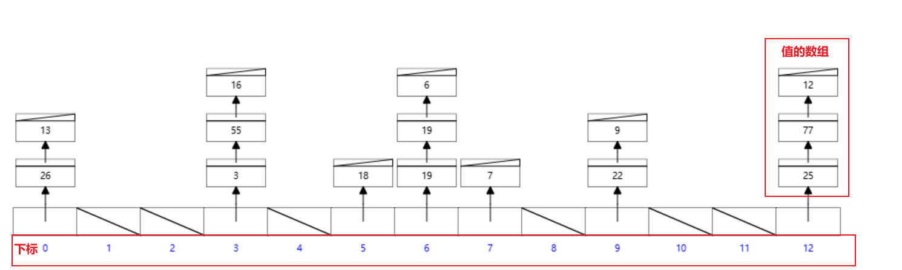

# 数据结构

## 

散列表\哈希表（Hash Table）

> 学名：散列表
>
> 维基百科：https://zh.wikipedia.org/wiki/%E5%93%88%E5%B8%8C%E8%A1%A8

### 概念

> 根据**键**（Key）而直接访问在**存储器存储位置**的数据结构。也就是说，它通过计算出一个**键值**的函数，将所需查询的数据映射到表中一个位置来让人访问，这**加快了查找速度**。这个映射函数称做散列函数，存放记录的数组称做散列表。

- 若**关键字为 k** ，则其值存放在 **F(k) 的存储位置**上。由此，**不需比较**便可直接获取所查记录。称这个对应关系 **F 为散列函数**，按这个思想建立的表为散列表（哈希表）。
- 对不同的关键字可能得到同一散列地址，即 k1 ≠ k2 ，而 F(k1) = F(k2) ，这种现象称为冲突。根据 散列函数F(k) 和 处理冲突的方法 将一组关键字**映射**到一个有限的**连续的**空间上，这种表便称为**散列表**。

#### 举例

手机通讯录中，可以根据姓名首字母查询对应数据。例如查询“王”（这是关键字k）姓就可以输入“W”（这是F(k)）定位到对于的列表，比挨个找快很多。

### 实现

1. 通过**固定的算法**把key转换为数字；
2. 将数字通过**求余**（F函数）的方式，找到要存储的位置（下标）；
3. 把值放入该下标的**数组**（解决冲突的关键字）中；

### 处理冲突

- 开放寻址法
- 单独链表法：将散列到**同一个存储位置的所有元素保存在一个链表中**。实现时，一种策略是散列表同一位置的所有冲突结果都是用栈存放的，新元素被插入到表的前端还是后端完全取决于怎样方便。（上边图中使用的就是该解决方案）
- 双散列
- 再散列
- 公共溢出区

### Hash函数\散列函数 ，F(k)

- 除留取余法：Hash表的最大长度为m，取不大于m的最大质数p，然后对关键字进行取余运算。（上边图中使用的就是该解决方案）
- 折叠法
- 平方取中法
- 直接定址法

### 优缺点